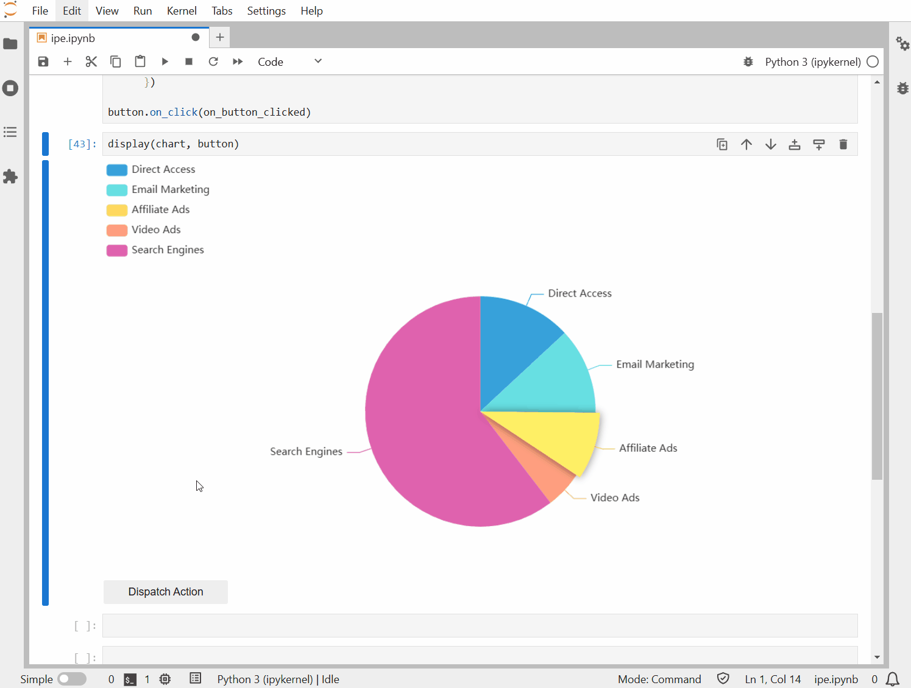

<h1 align="center">ipecharts</h1>

[](https://github.com/trungleduc/ipecharts/actions/workflows/build.yml)
[](https://ipecharts.readthedocs.io/en/latest/?badge=latest)
[](https://trungleduc.github.io/ipecharts/)

<h2 align="center"> Apache Echarts Jupyter Widget </h2>

`ipecharts` brings interactive widgets based on [Apache ECharts](https://echarts.apache.org/en/index.html) charting library to the Jupyter ecosystem. By using the Jupyter Widget protocol, `ipecharts` is fully compatible with other widget libraries and tools in the Jupyter ecosystem.

https://github.com/trungleduc/ipecharts/assets/4451292/c6e73b4d-61ef-4098-a274-92233d0801b0

> [!NOTE]  
> [`pyecharts`](https://pyecharts.org) also supports using Echarts in the notebook, but they are not using Jupyter Widget like `ipecharts`. In this library, HTML code is injected into the notebook to render the chart.

## Try it online!

You can try it online by clicking on this badge:

[](https://trungleduc.github.io/ipecharts/)

## Documentation

You can read the documentation following this link: https://ipecharts.readthedocs.io/

## Installation

To install the extension, execute:

```bash
pip install ipecharts
```

or with conda:

```bash
conda install -c conda-forge  ipecharts
```

## Usage

`ipecharts` widgets are generated automatically from `ECharts 5.5.0`. It provides two high-level widgets to create charts in notebooks: `EChartsRawWidget` and `EChartsWidget`.

### Create charts using `EChartsRawWidget`

`EChartsRawWidget` is a simple widget to render `ECharts` option dictionary. It is fully compatible with the JavaScript version of `ECharts`. Here is an example of converting the [following JS example](https://echarts.apache.org/examples/en/editor.html?c=area-basic):

```javascript
import * as echarts from 'echarts';

var chartDom = document.getElementById('main');
var myChart = echarts.init(chartDom);
var option;

option = {
  xAxis: {
    type: 'category',
    boundaryGap: false,
    data: ['Mon', 'Tue', 'Wed', 'Thu', 'Fri', 'Sat', 'Sun']
  },
  yAxis: {
    type: 'value'
  },
  series: [
    {
      data: [820, 932, 901, 934, 1290, 1330, 1320],
      type: 'line',
      areaStyle: {}
    }
  ]
};

option && myChart.setOption(option);
```

into using `EChartsRawWidget`:

```python
from ipecharts import EChartsRawWidget

option = {
  'xAxis': {
    'type': 'category',
    'boundaryGap': False,
    'data': ['Mon', 'Tue', 'Wed', 'Thu', 'Fri', 'Sat', 'Sun']
  },
  'yAxis': {
    'type': 'value'
  },
  'series': [
    {
      'data': [820, 932, 901, 934, 1290, 1330, 1320],
      'type': 'line',
      'areaStyle': {}
    }
  ]
}

EChartsRawWidget(option=option)
```


### Create charts using `EChartsWidget`

While the raw widget can render the charts correctly, it lacks the interactivity of a Jupyter widget. `ipecharts` provides `EChartsWidget` and configuration classes for nearly all available options of ECharts to correct this issue.

Here is the equivalent of the above chart but using `EChartsWidget`:

```python
from ipecharts import EChartsWidget
from ipecharts.option import Option, XAxis, YAxis
from ipecharts.option.series import Line

line = Line(data=[820, 932, 901, 934, 1290, 1330, 1320], areaStyle={})
option = Option(
    xAxis=XAxis(
        type="category",
        boundaryGap=False,
        data=["Mon", "Tue", "Wed", "Thu", "Fri", "Sat", "Sun"],
    ),
    yAxis=YAxis(type="value"),
    series=[line],
)
EChartsWidget(option=option)
```

While it looks more verbose, the advantage is the reactivity. We can update the line data and have the chart updated automatically.


### Configure `EChartsWidget` with `traitlets`

Each key in the [option dictionary](https://echarts.apache.org/en/option.html#title) of ECharts has an equivalent configuration class with the same name. These classes contain traits with the same name as the corresponding ECharts option. Any change to these traits will be propagated to the top-level widget, and the chart will be updated automatically.

For instance, you can compare the scatter option of ECharts at https://echarts.apache.org/en/option.html#series-scatter.type and the equivalent Scatter class in the [ipecharts documentation](https://ipecharts.readthedocs.io/en/latest/api/ipecharts.option.seriesitems.html#module-ipecharts.option.seriesitems.scatter). The Python class is generated automatically from the ECharts option.

By using Traitlets to configure your widget, you can use EChartsWidget with other widgets in the Jupyter ecosystem. Here is an example of controlling the chart with an ipywidgets Button:

```python
from ipecharts.option import Option, XAxis, YAxis
from ipecharts.option.series import Line
from ipywidgets.widgets import Button

line = Line(smooth=True, areaStyle={}, data=numpy.random.rand(10).tolist())
option = Option(
    xAxis=XAxis(type="category"),
    yAxis=YAxis(type="value"),
    series=[line],
)
chart = EChartsWidget(option=option)

button = Button(description="Generate data")
def on_button_clicked(b):
    data = numpy.random.rand(10).tolist()
    line.data = data

button.on_click(on_button_clicked)

display(button, chart)
```


### Customize the chart initialization

Both `EChartsWidget` and `EChartsRawWidget` classes can customize the [Echarts init parameters](https://echarts.apache.org/en/api.html#echarts.init), for example:

```python

chart = EChartsWidget(
    option=option, renderer="svg", width="300px", height="300px", use_dirty_rect=True
)

```

The init parameters need to be converted to the snake case format.

### Customize the chart container style

Both `EChartsWidget` and `EChartsRawWidget` classes allow you to customize the style of the chart container by setting the style attribute. The style attribute accepts a dictionary where keys are CSS property names in camelCase or kebab-case (as strings), and values are the corresponding CSS values.

Example: 'backgroundColor': '#f0f0f0' or 'background-color': '#f0f0f0'

```python

from ipecharts import EChartsWidget
from ipecharts.option import Option, XAxis, YAxis
from ipecharts.option.series import Line

# Define the data for the line series
line = Line(
    data=[820, 932, 901, 934, 1290, 1330, 1320],
    areaStyle={}
)

# Create the option object with xAxis, yAxis, and series
option = Option(
    xAxis=XAxis(
        type="category",
        boundaryGap=False,
        data=["Mon", "Tue", "Wed", "Thu", "Fri", "Sat", "Sun"]
    ),
    yAxis=YAxis(type="value"),
    series=[line]
)

# Define the style for the widget
style = {
    'width': '450px',
    'height': '300px',
    'border': '5px solid #ccc'
}

# Create the EChartsWidget with the option and style
chart = EChartsWidget(option=option, style=style)

# Display the chart
chart
```

After the widget has been created and displayed, you can update its style by modifying the style attribute.

```python

# Update the style of the chart
chart.style = {
    'width': '800px',
    'height': '600px',
    'border': '2px solid #000'
}

# The widget will automatically update to reflect the new styles.

```

https://github.com/user-attachments/assets/e4245101-8dff-40a9-a4d4-1f75a06b88c4

### Event handling

Event-handling functions can be added to `EChartsWidget` and `EChartsRawWidget` using the same syntax as [in the Javascript version](https://echarts.apache.org/handbook/en/concepts/event/):

```python
chart = EChartsWidget(option=option)

def callback(params):
    print(params)

# Add event handlers
chart.on('click', None, callback) # Listen to all click event
chart.on('click', 'series.line', callback) # Using string query
chart.on('mouseover', {'seriesIndex': 1, 'name': 'xx'}, callback) # Using object query

# Remove event handlers
chart.off('click') # Remove all handler on click event
chart.off('mouseover', callback) # Remove selected handler.
```

### Chart actions

Chart actions supported by ECharts can by triggered by the `EChartsWidget.dispatchAction` or `EChartsRawWidget.dispatchAction` method. This method takes the same payload as [in the Javascript version](https://echarts.apache.org/en/api.html#action):

```python
chart = EChartsWidget(option=option)
chart.dispatchAction({
    'type': 'highlight',
    'seriesIndex': 0,
    'dataIndex': 1
  })
```



### Using JS function in chart options

`EChartsWidget` and `EChartsRawWidget` support passing JS functions to the chart options via the helper `ipecharts.tools.encode_js_function`. For example, to use a JS function as the tooltip formatter, you can do the following:

```python
from ipecharts.tools import encode_js_function
from ipecharts.option import Tooltip

formatter = encode_js_function(['params'], "return params.value[3] + ': ' + params.value[0];")
tooltip = Tooltip(trigger='item', formatter=formatter)
```

The `encode_js_function` function takes a list of parameter names and a string containing the JS function body. `ipecharts` will automatically generate the JS function for the chart options in the front-end.
