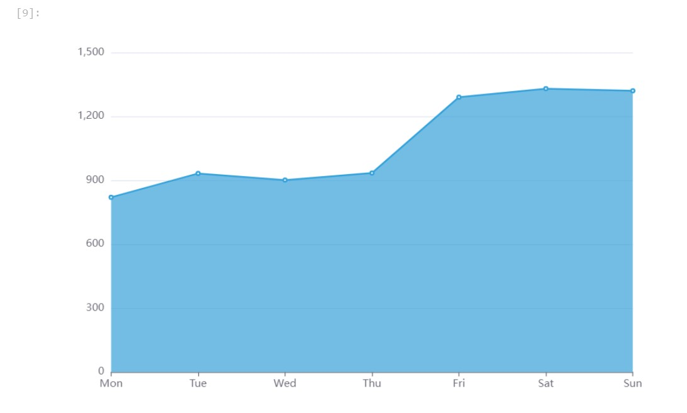
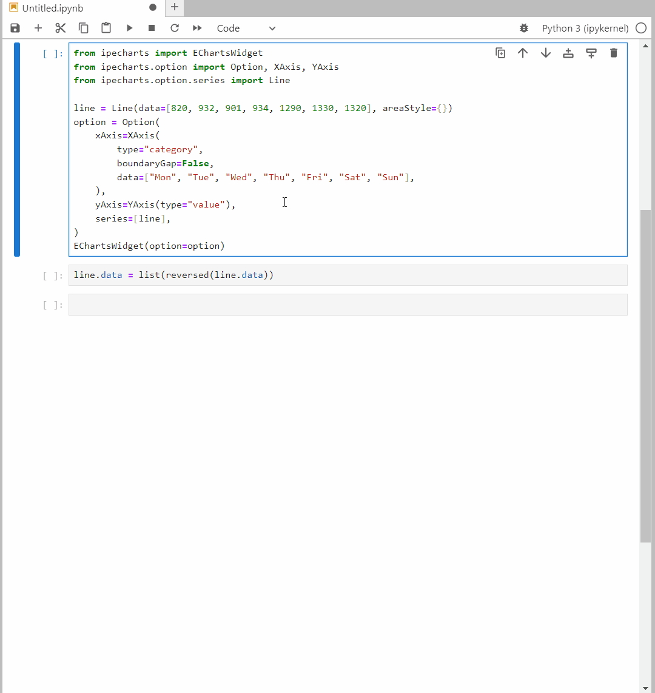
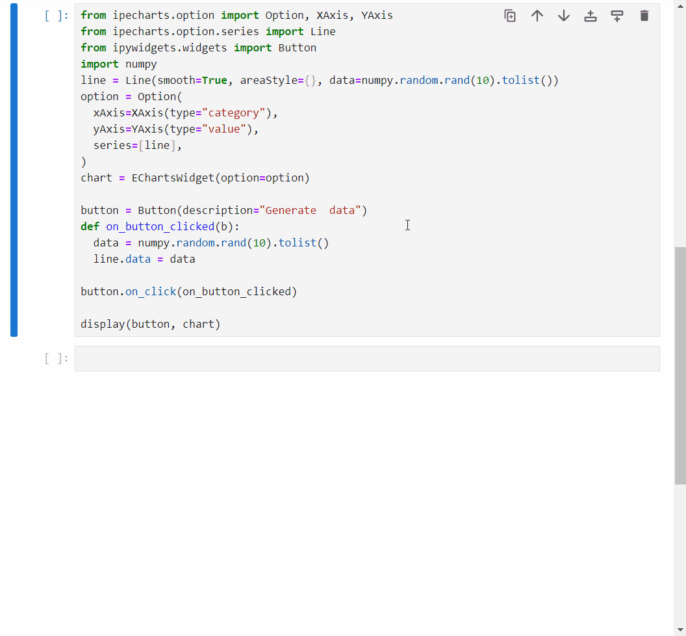

=========================
ipecharts Documentation
=========================

.. image:: https://jupyterlite.rtfd.io/en/latest/_static/badge.svg
    :target: https://trungleduc.github.io/ipecharts/
    :alt: try it here

---------------------------------------------------------------------

    Apache ECharts Jupyter widgets.

`ipecharts` brings interactive widgets based on `Apache ECharts <https://echarts.apache.org/en/index.html>`_. charting library to the Jupyter ecosystem.

Installation
********************************

To get started with **ipecharts**, install with pip::

    pip install ipecharts

or with conda::

    conda install -c conda-forge  ipecharts

Check your installation with::

    jupyter labextension list

**ipecharts** works with **ipywidgets** >=8.

Usage
********************

`ipecharts` widgets are generated automatically from `ECharts 5.5.0`, it provides two high-level widgets to create charts in notebook: `EChartsRawWidget` and `EChartsWidget`

Create charts using `EChartsRawWidget`
^^^^^^^^^^^^^^^^^^^^^^^^^^^^^^^^^^^^^^^

`EChartsRawWidget` is a simple widget to render `ECharts` option dictionary. It's fully compatible with the Javascript version of `ECharts`. Here is an example of converting the `following JS example <https://echarts.apache.org/examples/en/editor.html?c=area-basic>`_:

.. code-block:: javascript

  import * as echarts from 'echarts';

  var chartDom = document.getElementById('main');
  var myChart = echarts.init(chartDom);
  var option;

  option = {
    xAxis: {
      type: 'category',
      boundaryGap: false,
      data: ['Mon', 'Tue', 'Wed', 'Thu', 'Fri', 'Sat', 'Sun']
    },
    yAxis: {
      type: 'value'
    },
    series: [
      {
        data: [820, 932, 901, 934, 1290, 1330, 1320],
        type: 'line',
        areaStyle: {}
      }
    ]
  };

  option && myChart.setOption(option);

into `EChartsRawWidget`:

.. code-block:: python

  from ipecharts import EChartsRawWidget

  option = {
    'xAxis': {
      'type': 'category',
      'boundaryGap': False,
      'data': ['Mon', 'Tue', 'Wed', 'Thu', 'Fri', 'Sat', 'Sun']
    },
    'yAxis': {
      'type': 'value'
    },
    'series': [
      {
        'data': [820, 932, 901, 934, 1290, 1330, 1320],
        'type': 'line',
        'areaStyle': {}
      }
    ]
  }

  EChartsRawWidget(option=option)

Create charts using `EChartsWidget`
^^^^^^^^^^^^^^^^^^^^^^^^^^^^^^^^^^^^^^^

While the raw widget can render the charts correctly, it lacks the interactivity of a Jupyter widget. `ipecharts` provides `EChartsWidget` and configuration classes for nearly all available options of `ECharts` to correct this issue. 

Here is the equivalent of the above chart but using `EChartsWidget`:

.. code-block:: python

  from ipecharts import EChartsWidget
  from ipecharts.option import Option, XAxis, YAxis
  from ipecharts.option.series import Line

  line = Line(data=[820, 932, 901, 934, 1290, 1330, 1320], areaStyle={})
  option = Option(
      xAxis=XAxis(
          type="category",
          boundaryGap=False,
          data=["Mon", "Tue", "Wed", "Thu", "Fri", "Sat", "Sun"],
      ),
      yAxis=YAxis(type="value"),
      series=[line],
  )
  EChartsWidget(option=option)

while it looks more verbose, the advantage is the reactivity, we can update the line data and have the chart updated automatically.

Configure widget with Traitlets
^^^^^^^^^^^^^^^^^^^^^^^^^^^^^^^^^^^^^^^

Each key in the `option dictionary <https://echarts.apache.org/en/option.html#title>`_ of `ECharts` has an equivalent configuration class with the same name. These classes contain traits with the same name as the corresponding EChart option. Any change of these traits will be propagated to the top-level widget and then the chart will be updated automatically.

For instance, you can compare the scatter option of `Echarts` at https://echarts.apache.org/en/option.html#series-scatter.type and the equivalent `Scatter class <https://ipecharts.readthedocs.io/en/latest/api/ipecharts.option.seriesitems.html#module-ipecharts.option.seriesitems.scatter>`_. The python class is generated automatically from the Echarts option.

By using the Traitlets to configure your widget. You can use `EChartsWidget` with other widgets in Jupyter ecosystem, here is an example of controlling the chart with ipywidgets `Button`:

.. code-block:: python

  from ipecharts.option import Option, XAxis, YAxis
  from ipecharts.option.series import Line
  from ipywidgets.widgets import Button

  line = Line(smooth=True, areaStyle={}, data=numpy.random.rand(10).tolist())
  option = Option(
      xAxis=XAxis(type="category"),
      yAxis=YAxis(type="value"),
      series=[line],
  )
  chart = EChartsWidget(option=option)

  button = Button(description="Generate  data")
  def on_button_clicked(b):
      data = numpy.random.rand(10).tolist()
      line.data = data

  button.on_click(on_button_clicked)

  display(button, chart)

.. note::
 Reference to the series configurations can be found `here <https://ipecharts.readthedocs.io/en/latest/api/ipecharts.option.seriesitems.html>`_, but it is more legible to use directly the `documentation of Echarts <https://echarts.apache.org/en/option.html>`_.

API Reference
********************************

.. toctree::
    :maxdepth: 3
    
    api/ipecharts

